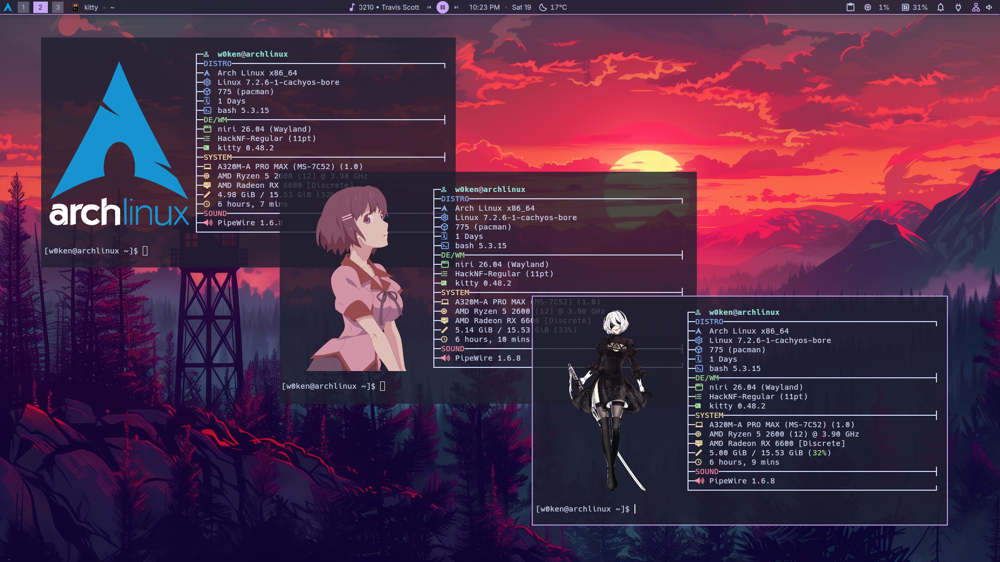
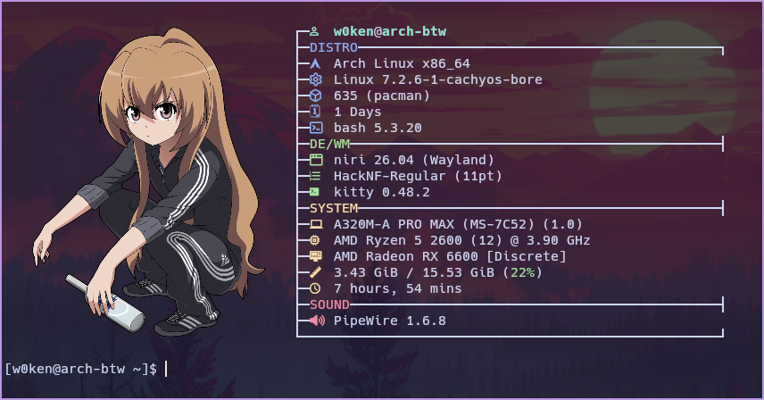
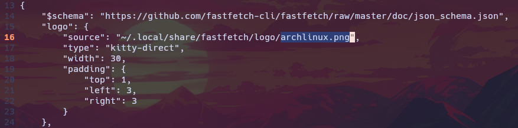

# w0keN Fastfetch

### Welcome to my fastfetch preset repository

[Fastfetch](https://github.com/fastfetch-cli/fastfetch) is a tool for fetching system information and displaying it in a visually appealing way. This repo contains my personal config made for [Kitty](https://sw.kovidgoyal.net/kitty/) which is a GPU based terminal emulator, that means this terminal emulator is fast and capable to show emojis and images, so feel free to use it, copy things and modify it to make it YOURS.


---
### Requirements
>This is not a standalone, for it to work properly you'll need to install:
- [Fastfetch](https://github.com/fastfetch-cli/fastfetch)
- [Kitty](https://sw.kovidgoyal.net/kitty/)
- [Nerd Fonts](https://www.nerdfonts.com/font-downloads).

### Installation guide

**1. Install Fastfetch: The following table shows base distros, the cmd works for their fork distros too.**

| Distribution | Terminal Command |
| ------------ | ---------------- |
| Arch         | sudo pacman -Sy fastfetch |
| Debian / Ubuntu | sudo apt install fastfetch |
| Fedora | sudo dnf install fastfetch |

**2. Install a Nerd Font: This config uses Nerd Font icons. Without one you'll see empty boxes.**

> The screenshot font is "Hack Nerd Font".

- Create a `fonts` directory into `~/.local/share`: 

```
mkdir -p ~/.local/share/fonts

```
- Visit [Nerd Fonts](https://www.nerdfonts.com/font-downloads) website and download the one you like the most, unzip it and copy every `.ttf` and `.otf` inside the `~/.local/share/fonts` directory you made.
- Run:

```
fc-cache -fv
```

**3. Clone the repository into `~/.local/share`:**
```
git clone https://github.com/w0kenn/fastfetch ~/.local/share/fastfetch   
```
- Now apply the preset you like the most: (for now there is only one, but in the future i'll keep adding variety)


```
cp ~/.local/share/fastfetch/presets/main.jsonc ~/.config/fastfetch/config.jsonc
```

---

### How to change the PNG logo:

- Modify this section of the `~/.config/fastfetch/config.jsonc` file keeping the " at the end.



- Replace it with the file name of the image you want to use.
>You can find them inside `~/.local/share/fastfetch/logo`.

Actual PNGs: `archlinux.png` `arch.png` `tsubasa.png` `aisaka.png` `loli.png` `2b1.png` `2b2.png`

>To add custom images you need to put them inside `~/.local/share/fastfetch/logo` folder. (Recommended size: 1080x1440 or equivalent 3:4 aspect. I recommend you also name the image without spaces, or spacing with `-`, Example: custom-image.png , also use lower case to keep it easy and avoid errors.
